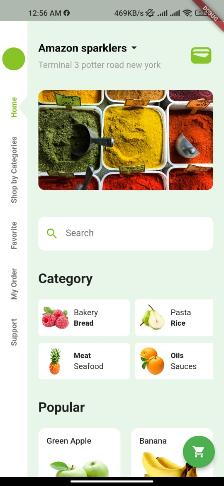
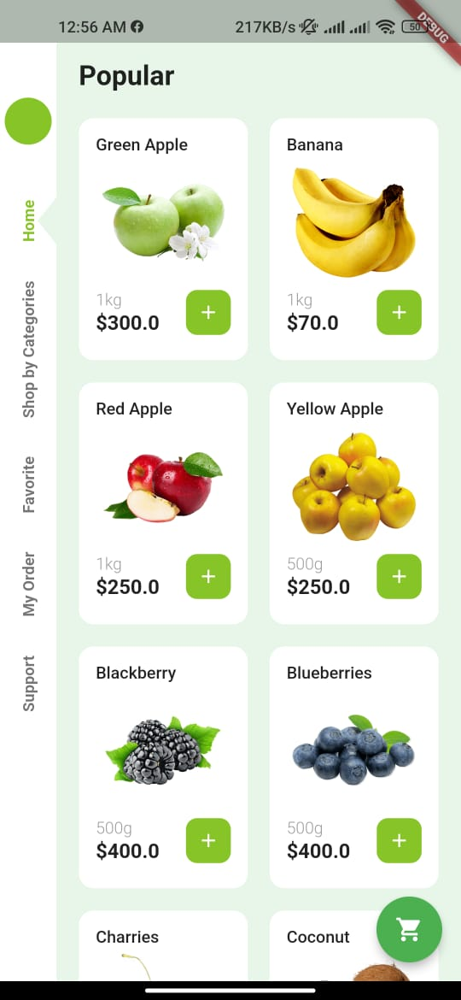
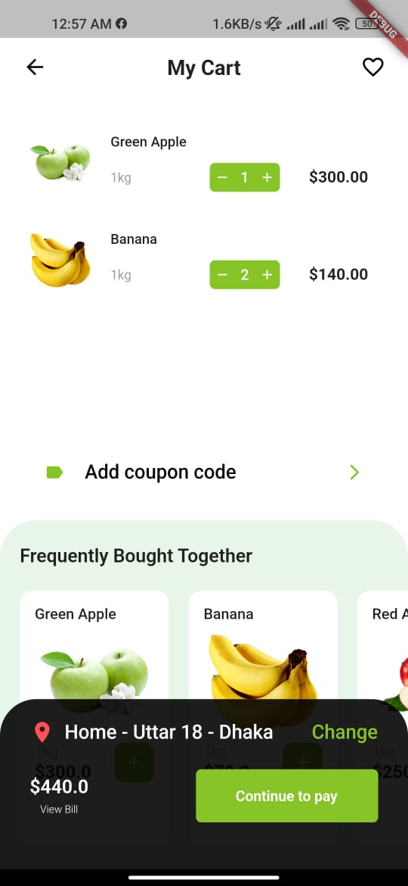
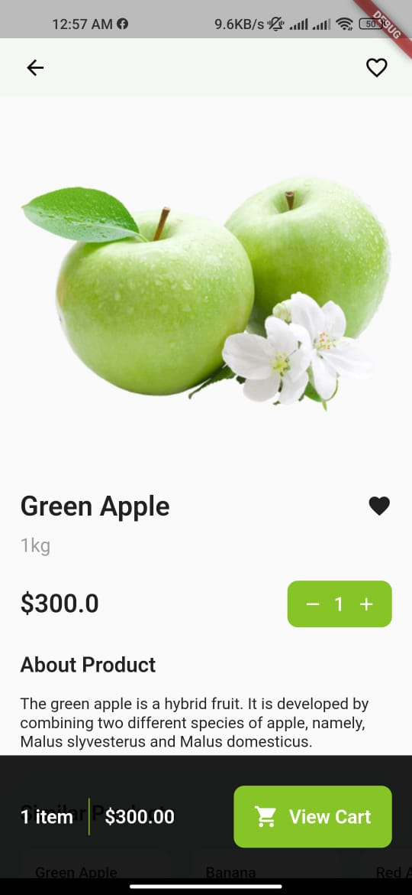
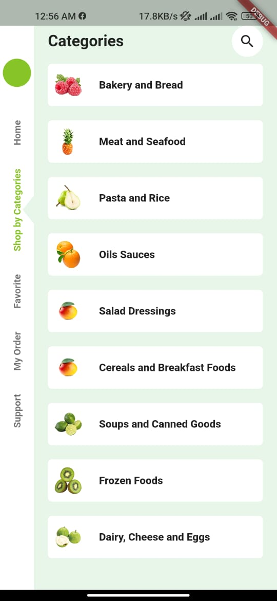

# Instant Shop

## Shop app

A simple shop app created using flutter. And uses RiverPod for state management.

---

This app is currently under development. Please use it at your own risk. Any type of feedback is welcome.

## Main Feature and Functionality (With Description)

- Product Catalog
- Cart & Order
- Favorite Item

## Pattern and Language

This app written in Flutter. And RiverPod is used for state management.

## Roadmap

- Multer Vendor

## Screenshot

<!-- 

 -->

## Download

You can get this app from:

- Play Store (Upcoming)

## Contribute

If you found a bug please report [here](https://github.com/carbonanik/MessApp/issues/new)

If you wan a new feature or any change in existing feature. Please pull request.

## Dependency

- RiverPod
- Hive

## Contact

You can directly contact me on social media

- [LinkedIn](https://www.linkedin.com/in/carbonanik)
- [Twitter](https://twitter.com/carbonanik)
- [Facebook](https://www.facebook.com/carbon.anik)

or,

You can visit my website [here](https://carbonanik.com)